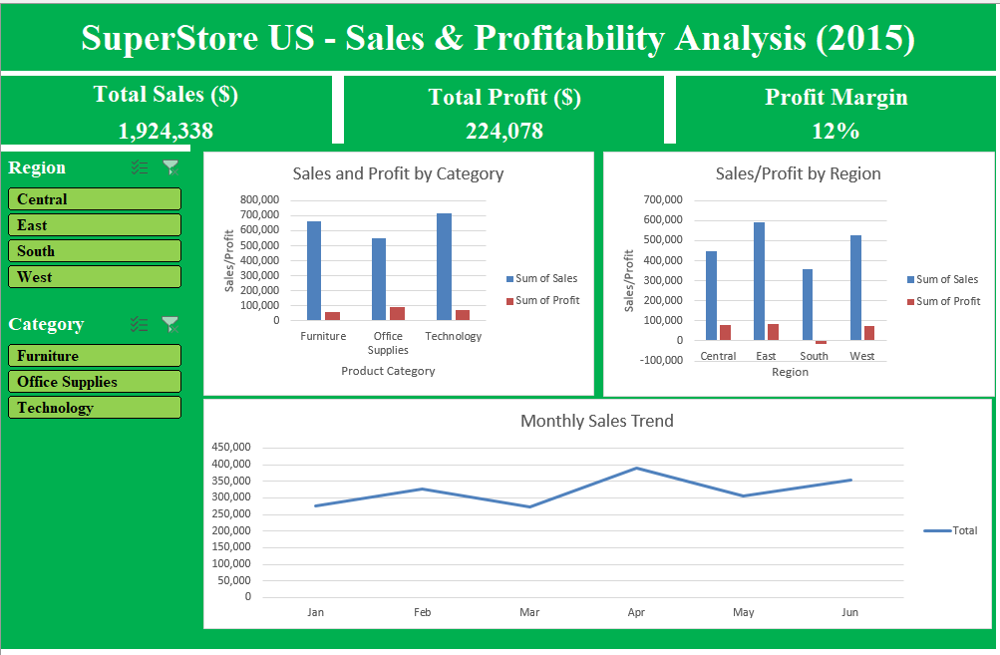

# 📊 SuperStore US - Sales & Profitability Dashboard (2015)

An interactive Excel dashboard analyzing sales and profitability for SuperStore US, based on ~1,950 real transaction records across 4 regions and 3 product categories.

## 🎯 Objective

Analyze company-wide sales performance and identify where profitability issues exist - even when overall numbers look healthy.

## 📈 Key Metrics

|    Metric     | Value      |
|---------      |--------    |
| Total Sales   | $1,924,338 |
| Total Profit  | $224,078   |
| Profit Margin | 12%        |

## 🔍 Key Finding: Hidden Regional Loss

While the company is profitable overall, **South is the only region operating at a loss (-$14,424)** - a problem invisible from the top-level summary alone.

### Root Cause Analysis (drill-down)

I traced the loss step, from region -> category -> sub-category -> individual product:

1. **Discount and shipping cost were ruled out** - South's average discount (4.98%) and shipping costs were in line with other regions.
2. **Category level:** the loss came almost entirely from Technology (-$13,450 of the -$14,424 total).
3. **Sub-category level:** within Technology, "Telephones and Communication" was the culprit (-$12,905), while the same sub-category was profitable in every other region.
4. **Product level:** a single SKU (5165) accounted for **-$16,375** in South alone - larger than the region's total loss - while the same product was profitable elsewhere.

**Business takeaway:** the issue isn't regional pricing strategy or discounting policy - it's isolated to one specific product in one specific region, which points to something like a local pricing error, a bad supplier deal, or a defective batch worth investigating.

### Bonus finding
I also found that **Office Machines in West region ran a loss of -$19,375** - the single largest sub-category loss in the whole dataset - but it was masked by strong profits elsewhere in that region. This shows why drilling into details matters even when a summary number looks positive.

## 🛠️ Skills Demonstrated 

- **Data quality check:** verified the dataset for duplicates, extra spaces, and inconsistent text formatting - confirmed data was clean and ready for analysis
- **Pivot Tables** with multi-level breakdowns (Region -> Category -> Sub-Category -> Product)
- **Interactive dashboard:** Slicers connected across multiple Pivot Tables (Report Connections)
- **Data visualization:** bar charts for category/region comparison, line chart for monthly trend
- **Analytical thinking:** correctly using SUM(Profit)/SUM(Sales) instead of AVERAGE of individual margins to avoid statistical distortion (Simpson's Paradox)

## 📁 Files

- `SuperStoreUS-2015.xlsx` - full workbook with raw data, pivot tables, and dashboard

## 📌 Data Source

Public "Superstore Sales" practice dataset, commonly used for data analytics training.
